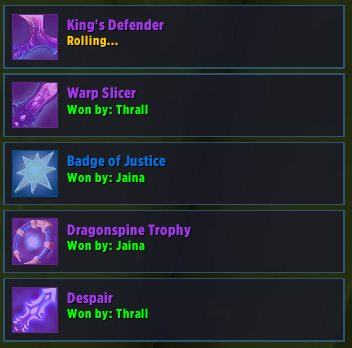
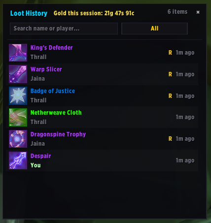
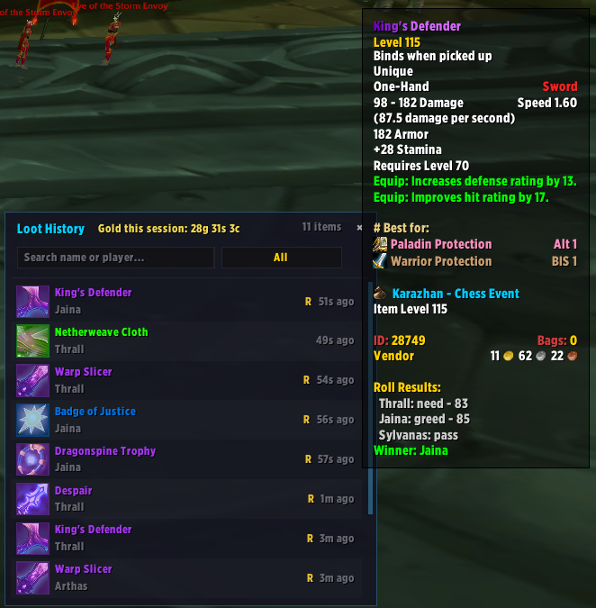
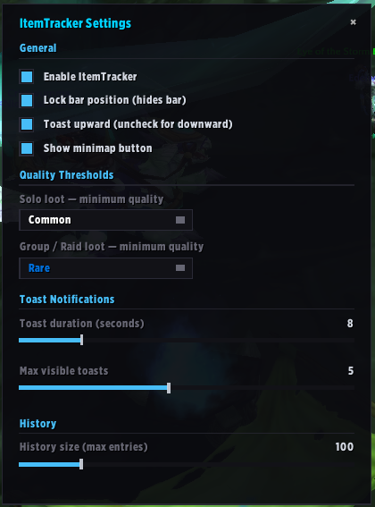

# ItemTracker

A loot tracking addon with toast notifications for WoW TBC Classic Anniversary Edition.

## Features

- **Toast Notifications** — Windows Action Center-style pop-ups for looted items with quality-colored borders, fade animations, and configurable duration
- **Solo & Group Loot** — separate minimum quality thresholds for solo and group/raid
- **Roll Tracking** — real-time Need/Greed/Pass roll tracking with live toast updates
- **RCLootCouncil Integration** — detects loot council sessions, shows voting progress, announces awards
- **LootReserve Integration** — tracks soft reserves, shows roll requests, announces winners
- **Quest Reward Tracking** — detects items received from quest NPCs
- **Loot History** — standalone pop-out window with item tooltips, roll details, name/player search, and quality filter
- **Gold Tracking** — session gold total shown in history header
- **Movable Anchor Bar** — toasts stack above or below; hides when locked, reveals on hover
- **Minimap Button** — draggable spyglass icon for quick access
- **Glassy Transparent Design** — dark semi-transparent backgrounds, thin borders, stays out of the way
- **Blizzard Interface Options** — registered in Interface > AddOns

## Compatibility

| | |
|---|---|
| **Game version** | TBC Classic Anniversary (2.5.5) |
| **Interface** | 20505 |
| **Version** | 0.2.1 |
| **Optional addons** | RCLootCouncil, LootReserve |

## Loot History

Browse past loot in a standalone pop-out window. Filter by item name, player name, or minimum quality. Rolled items are marked with an **R** indicator — hover to see the full roll breakdown and winner.

Session gold is tracked and displayed in the header.

### Roll Details

Hover over any rolled item to see who rolled, what type (Need/Greed/Pass/Council/Reserve), the roll number, and the winner.

## Configuration

Open settings with `/it config`, right-click the minimap button, or find **ItemTracker** in Interface > AddOns.

| Setting | Description | Default |
|---|---|---|
| Solo quality threshold | Minimum quality for solo loot toasts | Uncommon |
| Group quality threshold | Minimum quality for group/raid loot toasts | Uncommon |
| Toast duration | Seconds before toasts fade | 8 |
| Max visible toasts | Maximum simultaneous notifications | 5 |
| Toast upward | Stack toasts up (or down if unchecked) | On |
| Lock position | Hide anchor bar (reveals on hover) | Off |
| History size | Max entries kept in history | 100 |
| Show minimap | Show/hide minimap button | On |

## Slash Commands

| Command | Description |
|---|---|
| `/it` | Show available commands |
| `/it config` | Open settings panel |
| `/it history` | Toggle loot history panel |
| `/it clear` | Clear loot history and session gold |
| `/it status` | Show addon and integration status |
| `/it test` | Simulate a loot drop |
| `/it test roll` | Simulate a group roll |
| `/it test lc` | Simulate a loot council session |
| `/it test reserve` | Simulate a LootReserve roll |
| `/it debug` | Toggle debug output |
| `/it version` | Show addon version |

## Minimap Button

| Action | Effect |
|---|---|
| Left-click | Toggle window |
| Shift-click | Open loot history |
| Right-click | Open settings |
| Drag | Reposition around minimap |

## How It Works

1. **Loot Detection** — parses `CHAT_MSG_LOOT` and `QUEST_LOOT_RECEIVED` using locale-safe patterns built from Blizzard global strings, works on all WoW client languages
2. **Roll Tracking** — listens to `START_LOOT_ROLL` and roll result system messages; toasts persist during active rolls and update in real time
3. **External Addons** — hooks into RCLootCouncil and LootReserve APIs to track loot council votes and soft reserve rolls; safe when neither is installed
4. **History** — items stored in SavedVariables, persist across sessions; rolled items include full breakdown on tooltip hover; filter by name/player or quality
5. **Gold** — `CHAT_MSG_MONEY` tracked per session, shown in history header, not persisted
6. **Toasts** — appear from the anchor bar, stack in configurable direction, fade in/out; oldest recycled when max reached

## License

This project is licensed under the [MIT License](LICENSE).
