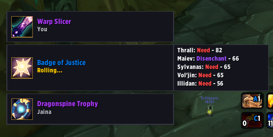
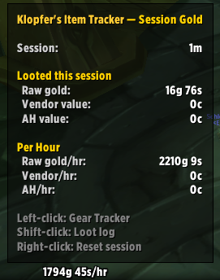
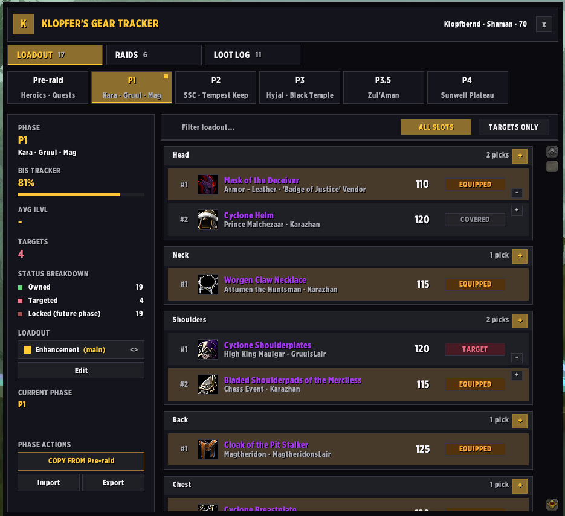

# Klopfer's Item Tracker

A loot tracker, session-gold dashboard, and per-character BiS / loadout
tracker for **WoW TBC Classic Anniversary (2.5.6)**.

## Features

### Loot Tracking
- **Toast Notifications** — pop-up cards for looted items, quality-coloured names, fade animations, configurable duration and cap
- **Solo & Group Loot** — separate minimum quality thresholds
- **Scrolling Loot Text** — every item you loot (and each coin pickup) scrolls on screen as fading text with icons, independent of the history quality thresholds. Own quality floor / scale / duration / direction; drag to position with `/kit loottext`. Self-contained engine (works after 2.5.6 removed Blizzard's Floating Combat Text)
- **Roll Tracking** — real-time Need / Greed / Pass with a live sorted ranking panel (top 5)
- **RCLootCouncil Integration** — detects loot council sessions, shows voting progress, announces awards
- **LootReserve Integration** — tracks soft reserves, shows roll requests, announces winners
- **Quest Reward Tracking** — picks up items received from quest NPCs

### Session Gold
- Running gold/hr rate with vendor (`GetItemInfo` sellPrice) and Auctionator AH valuation
- **LDB Data Broker** feed — works with ElvUI DataTexts, Titan Panel, ChocolateBar, or any LDB display
- Tooltip breaks down raw gold, vendor value, AH value, and per-hour rates

### GearGoals (BiS / loadout tracker)
- **Per-character, spec-aware, phase-organised** wishlist (pre-raid / 1 / 2 / 3 / 3.5 / 4)
- **Drop alert popup** when a tracked item drops — MS / OS roll buttons, fade-in + corner pulse animation
- **AtlasLoot integration** — boss · raid source labels resolve automatically when AtlasLootClassic is installed
- **Tier-token redemption** — tier set tokens auto-derive their class-specific pieces and show the right MS/OS redemption choices
- **Bulk import from TBCA_BIS** plus a round-trippable export string for sharing loadouts
- **LOOT LOG tab** — unified loot history with ALL / WISHLIST scope toggle, name + quality filters
- **Persistent bank tracking** — items in the bank count as OWNED even when you're not at the banker (cache populated on the first bank visit and survives logout)

## Compatibility

| | |
|---|---|
| **Game version** | TBC Classic Anniversary (2.5.6) |
| **Interface** | 20506 |
| **Version** | 0.8.0 |
| **Optional addons** | RCLootCouncil, LootReserve, Auctionator, ElvUI (or any LDB display), AtlasLootClassic, AtlasLootClassic_TBCA_BIS |

## Configuration

Settings live in **Esc → Interface → AddOns → Klopfer's Item Tracker**
(parent page) with a **GearGoals** sub-category beneath it.

The parent page uses the modern Blizzard Settings layout (native
checkboxes, sliders, dropdowns) — same look and feel as Molinari and
the built-in WoW pages. Quality dropdowns retain their quality-coloured
labels.

| Setting | Default |
|---|---|
| Enable Klopfer's Item Tracker | On |
| Lock anchor bar position | Off |
| Stack toasts upward | On |
| Show toasts for gold loot | Off |
| Show chat messages | On |
| Show minimap button | On |
| Solo loot — minimum quality | Uncommon |
| Group / Raid loot — minimum quality | Uncommon |
| Toast duration (seconds) | 8 |
| Maximum visible toasts | 5 |
| History size (max entries) | 100 |
| **GearGoals** — current phase | pre-raid |
| **GearGoals** — play sound when a tracked item drops | On |
| **GearGoals** — animate the BiS drop popup | On |

## Slash Commands

The dispatcher is intentionally lean — most things are reachable
through the UI. The CLI keeps only what's faster to type than to click.

| Command | Description |
|---|---|
| `/kit` | Toggle the Gear Tracker window |
| `/kit status` | Show integration status (RCLC / LootReserve / history count / gold rates / LDB) |
| `/kit clear` | Clear loot history and reset session gold |
| `/kit debug` | Toggle debug output |
| `/kit version` | Show addon version |
| `/kit test` | List available UI smoke-test simulators (`loot`, `gold`, `roll`, `council`, `reserve`, `bisdrop`, `token`) |

`/it` and `/itemtracker` are kept as aliases.

## Minimap Button & LDB DataText

| Action | Effect |
|---|---|
| Minimap left-click | Toggle Gear Tracker (LOADOUT tab default) |
| Minimap shift-click | Open Gear Tracker on the LOOT LOG tab |
| Minimap drag | Reposition around the minimap |
| LDB left-click | Toggle Gear Tracker |
| LDB shift-click | Open the LOOT LOG tab |
| LDB right-click | Reset session gold |
| Anchor bar left-click | Open the LOOT LOG tab |

## How It Works

1. **Loot detection** — `CHAT_MSG_LOOT` and `QUEST_LOOT_RECEIVED` are parsed using locale-safe patterns built from Blizzard global strings; works on every WoW client language.
2. **Roll tracking** — `START_LOOT_ROLL` plus the `C_LootHistory` API drive real-time updates; `LOOT_ROLLS_COMPLETE` is the definitive winner signal. Toasts persist during active rolls and update live.
3. **External addons** — RCLootCouncil and LootReserve hooks track loot council votes and soft reserve rolls, with per-source labelling on toasts. All hooks are no-ops when the addon is missing.
4. **Loot history** — items persist across sessions in `ItemTrackerDB.history`; rolled items include the full roll breakdown on tooltip hover; the LOOT LOG tab inside the Gear Tracker filters by name / player / quality and toggles between ALL and WISHLIST scope.
5. **Session gold** — `CHAT_MSG_MONEY` is tracked per session; vendor + AH per-hour rates feed the LDB DataText.
6. **GearGoals drop detection** — `ITEM_LOOTED` plus a chat-link scanner over party/raid/whisper channels match drops against the active goal set, honouring phase + rank suppression and an in-memory dedup set keyed by itemID.
7. **Bank ownership cache** — when the bank UI is open, every reachable bag is rescanned and the resulting set is persisted to `ItemTrackerCharDB.bankItems`. Goals stored in the bank stay marked as OWNED across logout, `/reload`, and travel.

## License

This project is licensed under the [MIT License](LICENSE).
